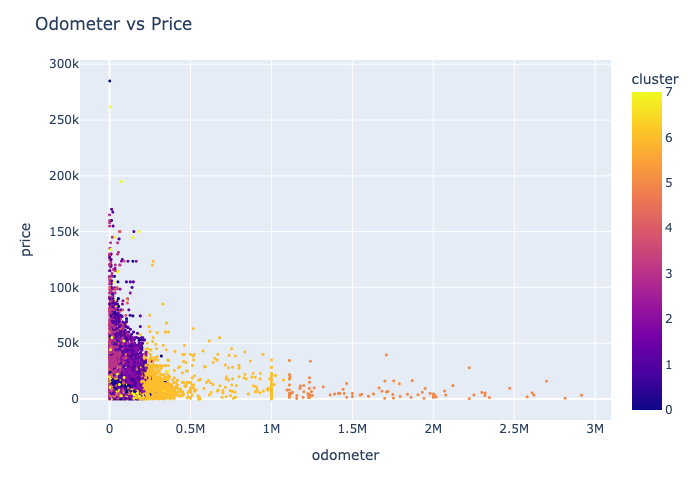

# ucb-mlai-mod-11
Module 11 assignment: what drives the price of a car?

# Overview
This repository contains an analysis of a dataset containing sales price information for various used vehicles. The raw data set consists of 426k samples and includes attributes of the vehicle, like odometer, year released, type of vehicle, etc., and the price the vehicle sold for.

The goal of this analysis is to determine what factors drive the sale price of used vehicles so that dealership can fine tune their inventory.

### Data source:
Original data source is from Kaggle. This data set was provided by the UCB MLAI certificate program designers.

### Repository Organization:
- `data\`: folder containing the data set that was examined
- `data\vehicles.csv`: the data set analyzed
- `images`: folder containing images used in the `README.md` and `prompt_II.ipynb` files
- `prompt_II.ipynb`: file containing the code and analysis for this project
- `utils.py`: python code file containing various utilities used in the analysis
- `README.md`: this page

## Summary of Findings

A dataset consisting of $426k$ samples was analyzed to determine what factors drive the sales price of used vehicles. The data set contains 17 features in addition to the sale price for used vehicles.

After cleaning and preparing the data for analysis, the model, presented in [prompt_II.ipynb](prompt_II.ipynb), was constructed that was able to demonstrate the ability to predict the price of a car based on its feature with a $R^2$ correlation coefficient of roughly $0.668$ on the test data set.

The model suggests the factors that most influence price are mileage and year. Newer used vehicles with low miles have the most potential to sell for more.

Vehicles with more than 680k miles don't sell for more than $50k. Newer cars are likely correlated with less mileage, and may also have features and amenities that drivers prefer.

**Recommendations**

Based on the model, the recommendations for used vehicle inventory include the following:
- Newer model vehicles, 2 or so years old.
- Less than 600k miles
- diesel
- coupes or pickups
- Porsche
- 8 cylinders
- 4wd

## Methodology
- Data was cleaned and prepared
  - removing outliers
  - dropping columns with a majority of missing values
  - dropping rows for well populated columns that are missing more than 5-10% of values
  - filling missing values with imputation for columns with less than 5% missing values
  - engineering polynomial feature for odometer and year
- Model
  - baseline model based on odometer and year
  - quadratic model to confirm need for polynomial features
  - linear model with all categorical and ordinal features added
  - Ridge regression model
  - Lasso model
  - Ridge regression model with Lasso Feature Selection
  - Cross Validation grid search for optimal model hyperparameters
- Feature Importance
  - Feature Importance Analysis using optimal model
  - Cluster Analysis of features to help visualize findings