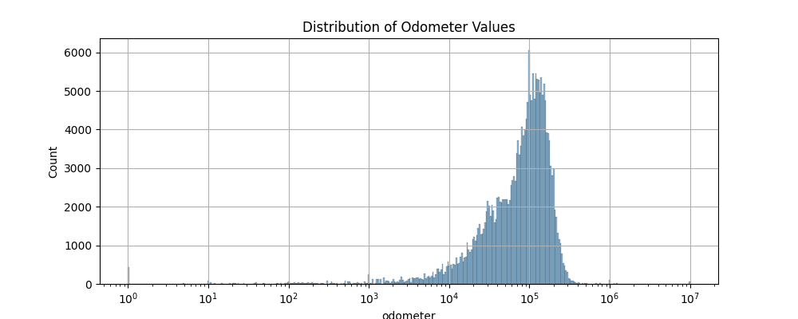

# ucb-mlai-mod-11
Module 11 assignment: what drives the price of a car?

# Overview
This repository contains an analysis of a dataset containing sales price information for various used vehicles. The raw data set consists of 426k samples and includes attributes of the vehicle, like odometer, year released, type of vehicle, etc., and the price the vehicle sold for.

The goal of this analysis is to determine what factors drive the sale price of used vehicles so that dealership can fine tune their inventory.

### Data source:
Original data source is from Kaggle. This data set was provided by the UCB MLAI certificate program designers.

### Repository Organization:
- `data\`: folder containing the data set that was examined
- `data\vehicles.csv`: the data set analyzed
- `images`: folder containing images used in the `README.md` and `prompt_II.ipynb` files
- `prompt_II.ipynb`: file containing the code and analysis for this project
- `utils.py`: python code file containing various utilities used in the analysis
- `README.md`: this page

## Summary of Findings

A dataset consisting of $426k$ samples was analyzed to determine what factors drive the sales price of used vehicles. The data set contains 17 features in addition to the sale price for used vehicles.

After cleaning and preparing the data for analysis, the model, presented in [prompt_II.ipynb](prompt_II.ipynb), was constructed that was able to demonstrate the ability to predict the price of a car based on its feature with a $R^2$ correlation coefficient of roughly $0.665$ on the test data set.

The model suggests the factors that most influence price are mileage and year. Newer used vehicles with low miles have the most potential to sell for more.

Vehicles with more than 680k miles don't sell for more than $50k. Newer cars are likely correlated with less mileage, and may also have features and amenities that drivers prefer.

**Recommendations**

Based on the model, the recommendations for used vehicle inventory include the following:
- Newer model vehicles
- Low mileage vehicles
- Diesel vehicles
- Ram made vehicles
- pickups or trucks
- 10 cylinders vehicles
- 4wd vehicles

# Next Steps

The data appears to favor certain types of vehicles that may not represent fairly the set of used vehicles generally available. The count of values by feature is shown in the figure below.

The distribution of vehicle mileage is shown below.

The vehicles in the dataset are predominantly recent model vehicles with 4, 6, or 8 cylinder gas engines and automatic transmission, in good or excellent condition, with around 100k miles. This is consistent with common observations of cars on the road in general, and most vehicles have 100k mile warranty. Many owners choose to sell their cars before the warranty expires. However, the vehicles in the dataset analyzed heavily favor 4wd vehicles. That may not represent generally used vehicles that are available for sale. 

As the chart above suggests, the number of vehicles vary greatly from state to state. Driving conditions can vary greatly depending on the types of weather conditions. Also, depending on whether the state is largely rural, or contains heavily populated urban centers, all these factors may impact the type of vehicle, or buyer preference by area. It may make sense to analyze the data by region or state to see whether there are regional preferences.

Possible next steps include:
- Evaluating with a dataset that is more representative of the set of vehicles generally available.
- Evaluating by state to see if there are regional preferences.